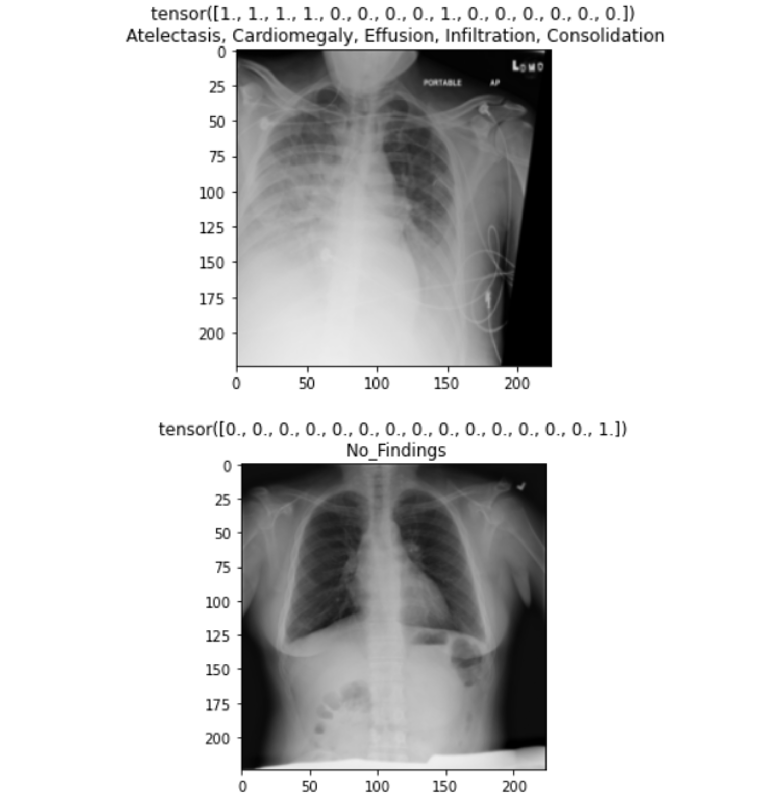
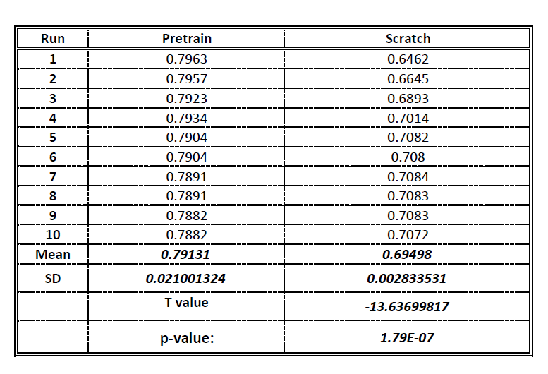
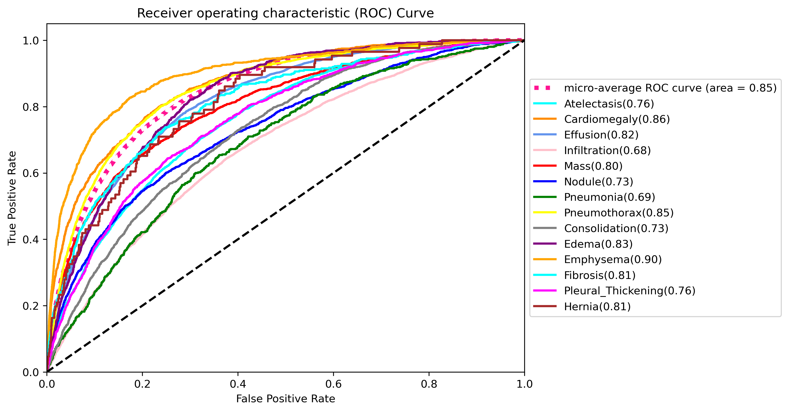

# NIH-CXR-SWIN

Welcome to the NIH-CXR-SWIN repository, a project dedicated to Chest X-ray classification using the Swin Transformer architecture. This repository provides a comprehensive solution for handling the NIH Chest X-ray dataset.

## Folder Structure

- **Dataset_files:** Contains text and CSV files pertaining to the NIH Chest X-ray dataset. These files are essential for data preprocessing and training.

- **Data.py:** This module encompasses the data pipeline, responsible for loading and preprocessing the NIH Chest X-ray dataset. It ensures seamless integration of the data into the training pipeline.

- **eval.py:** The evaluation pipeline is implemented here. This module facilitates the assessment of model performance on the NIH Chest X-ray dataset.

- **main.py:** The main file to run the entire project. This file orchestrates the execution of the data pipeline, training pipeline, and evaluation pipeline. Simply run this file to initiate the entire process.

- **train.py:** The training pipeline is defined in this module. It includes scripts for model training, saving checkpoints, and monitoring training progress.

- **swin_transformer.py:** The Swin Transformer model is implemented in this file. It contains the architecture and configurations for training and inference.

## Data Visualization

<div style="display: flex; justify-content: space-between; align-items: center;">

  <div>
    
    <p><em>Caption: A sample of Chestxray images from the NIH dataset.</em></p>
  </div>

</div>


## Getting Started

1. **Clone the Repository:**
   ```bash
   git clone https://github.com/your-username/NIH-CXR-SWIN.git
   cd NIH-CXR-SWIN
   ```

2. **Install Dependencies:**
   ```bash
   pip install -r requirements.txt
   ```

3. Download and Prepare the Dataset:

- Download the dataset from https://nihcc.app.box.com/v/ChestXray-NIHCC.
- Place the downloaded files in the Dataset_files folder.

4. **Run the Project:**
   ```bash
   python main.py
   ```

## Results

<div style="display: flex; justify-content: space-between; align-items: center;">

  <div>
    <p><em>Caption: Results of CAD-PE Segmentation</em></p>
    
    
  </div>

  <div>
    
    <p><em>Caption: Results of CAD-PE Localization</em></p>
  </div>

</div>


## Acknowledgments

- Swin Transformer: [https://github.com/microsoft/Swin-Transformer](https://github.com/microsoft/Swin-Transformer)
- NIH Chest X-ray Dataset: [https://www.nih.gov/](https://www.nih.gov/)
- If you use or reference the CAD-PE dataset, please provide proper attribution as per the following publication:
  ```plaintext 
    @InProceedings{wang2017chestxray,
    author = {Wang, Xiaosong and Peng, Yifan and Lu, Le and Lu, Zhiyong and Bagheri, Mohammadhadi and Summers, Ronald},
    title = {ChestX-ray8: Hospital-scale Chest X-ray Database and Benchmarks on Weakly-Supervised Classification and Localization of Common Thorax Diseases},
    booktitle = {2017 IEEE Conference on Computer Vision and Pattern Recognition (CVPR)},
    pages = {3462--3471},
    year = {2017}
    }
    ``` 

## Contributing

We welcome contributions from the community. If you find any issues or have suggestions for improvements, please feel free to open an issue or submit a pull request.
